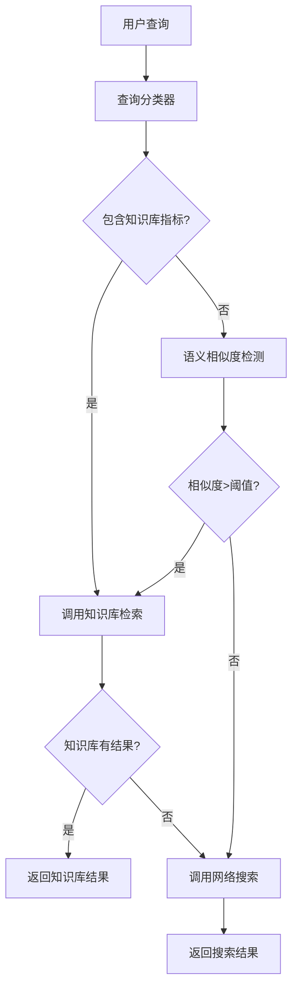

# RAG系统优化技术文档

## 📋 目录
1. [现状分析](#现状分析)
2. [优化目标](#优化目标)
3. [技术方案](#技术方案)
4. [实施步骤](#实施步骤)
5. [测试验证](#测试验证)
6. [性能监控](#性能监控)

## 🔍 现状分析

### 当前表现
- **知识库使用率**: 25% (目标: >70%)
- **明确指向性查询成功率**: 100%
- **隐含性查询成功率**: 20%
- **信息准确性**: 100% (当使用知识库时)

### 核心问题
1. **语义理解不足**: Agent无法识别隐含的知识库需求
2. **关键词匹配局限**: 依赖明确的触发词，缺乏上下文推理
3. **决策逻辑简单**: 缺乏多层次的工具选择判断机制

## 🎯 优化目标

### 主要目标
- **知识库使用率**: 提升至70%以上
- **查询覆盖率**: 覆盖90%以上的留学相关查询
- **响应准确性**: 保持100%的信息准确性
- **响应时间**: 控制在15秒以内

### 次要目标
- **工具协调**: 实现智能的多工具协同
- **上下文理解**: 增强对话连续性和语义理解
- **用户体验**: 提供更自然、专业的交互体验

## 🛠️ 技术方案

### 方案1: 智能查询分类器

#### 技术架构
```python
class QueryClassifier:
    """查询分类器 - 预处理用户查询，判断工具需求"""
    
    def __init__(self):
        self.knowledge_base_indicators = [
            # 直接指标
            "案例", "成功案例", "申请案例", "知识库", "文档", "上传的",
            # 学校名称
            "CMU", "Stanford", "MIT", "Harvard", "Berkeley", "Princeton",
            # 具体分数
            r"GPA\s*[:\s]*\d+\.\d+", r"托福\s*[:\s]*\d+", r"GRE\s*[:\s]*\d+",
            # 申请相关具体内容
            "推荐信", "文书写作", "个人陈述", "面试准备", "申请流程",
            "申请时间", "申请费用", "录取结果"
        ]
        
        self.web_search_indicators = [
            # 时间相关
            "2024", "2025", "最新", "当前", "最近", "今年",
            # 排名相关
            "排名", "录取率", "申请要求", "政策", "新闻"
        ]
    
    def classify_query(self, query: str) -> str:
        """分类查询类型"""
        # 实现智能分类逻辑
        pass
```

#### 实施步骤
1. **集成分类器**: 在Agent调用前增加查询预处理
2. **扩展指标库**: 建立更全面的关键词和模式库
3. **语义增强**: 使用词向量相似度计算

### 方案2: 多层次决策系统

#### 决策流程


#### 技术实现
```python
class MultiLayerDecisionEngine:
    """多层次决策引擎"""
    
    def __init__(self):
        self.classifier = QueryClassifier()
        self.similarity_threshold = 0.7
        
    async def decide_tools(self, query: str) -> List[str]:
        """决定使用哪些工具"""
        tools = []
        
        # 第一层: 直接匹配
        if self.classifier.has_kb_indicators(query):
            tools.append("knowledge_base_retriever")
            
        # 第二层: 语义相似度
        elif self.classifier.semantic_similarity(query) > self.similarity_threshold:
            tools.append("knowledge_base_retriever")
            
        # 第三层: 默认搜索
        else:
            tools.append("web_search")
            
        return tools
```

### 方案3: 强化系统提示

#### 优化策略
1. **明确的判断流程**: 添加step-by-step的决策步骤
2. **例子驱动**: 提供具体的正面和负面例子
3. **强制性指令**: 使用"必须"、"强制"等强调词

#### 新系统提示模板
```python
ENHANCED_SYSTEM_PROMPT = """
你是专业的AI留学规划师"启航AI"。

🚨 核心工具使用规则 (严格执行):

STEP 1: 查询分析
- 检查查询是否包含: 案例、GPA、托福、GRE、学校名称、推荐信、文书、面试等
- 检查是否提到: 知识库、文档、上传的、根据等

STEP 2: 强制性判断
如果STEP 1中任一条件满足，必须调用 knowledge_base_retriever 工具

STEP 3: 补充搜索
仅当知识库无相关结果时，才考虑 web_search

📋 具体示例:
✅ 必须使用知识库:
- "有CMU申请案例吗?" → knowledge_base_retriever
- "GPA 3.8能申请哪些学校?" → knowledge_base_retriever  
- "推荐信怎么写?" → knowledge_base_retriever

❌ 可以使用网络搜索:
- "2024年最新排名" → web_search
- "最新政策变化" → web_search

⚠️ 违反规则将导致回答不准确!
"""
```

## 📝 实施步骤

### 阶段1: 查询预处理增强 (1-2天)

1. **创建查询分类器**
   ```bash
   # 创建新文件
   touch app/agents/langgraph/query_classifier.py
   ```

2. **实现关键词扩展**
   - 建立更全面的关键词库
   - 添加正则表达式模式匹配
   - 实现语义相似度计算

3. **集成到Agent中**
   - 修改`_call_model`方法
   - 添加预处理步骤

### 阶段2: 决策引擎优化 (2-3天)

1. **多层次决策逻辑**
   ```python
   # 在 standard_agent.py 中添加
   class EnhancedDecisionEngine:
       def analyze_query_intent(self, query: str) -> Dict[str, Any]:
           # 实现意图分析
           pass
   ```

2. **工具选择策略**
   - 实现智能工具选择
   - 添加工具组合逻辑
   - 增加置信度评估

### 阶段3: 系统提示强化 (1天)

1. **重写系统提示**
   - 使用更强的指令性语言
   - 添加具体的判断步骤
   - 提供更多示例

2. **A/B测试对比**
   - 对比新旧系统提示效果
   - 评估知识库使用率提升

### 阶段4: 测试验证 (2天)

1. **创建综合测试套件**
2. **性能基准测试**
3. **用户场景模拟**

## 🧪 测试验证

### 测试用例设计

#### 隐含性查询测试
```python
IMPLICIT_QUERIES = [
    "推荐信准备步骤",        # 应使用知识库
    "文书写作技巧",          # 应使用知识库  
    "面试注意事项",          # 应使用知识库
    "申请时间安排",          # 应使用知识库
    "GPA要求是多少",         # 应使用知识库
]
```

#### 边界情况测试
```python
BOUNDARY_QUERIES = [
    "申请建议",              # 模糊查询
    "留学准备",              # 广泛查询
    "学校推荐",              # 可能需要多工具
]
```

### 性能指标

| 指标 | 当前值 | 目标值 | 测试方法 |
|------|--------|--------|----------|
| 知识库使用率 | 25% | >70% | 自动化测试 |
| 响应准确性 | 100% | 100% | 人工评估 |
| 响应时间 | 15s | <15s | 性能监控 |
| 用户满意度 | - | >90% | 用户反馈 |

## 📊 性能监控

### 监控指标
```python
class RAGMetrics:
    """RAG系统性能指标"""
    
    def __init__(self):
        self.metrics = {
            "kb_usage_rate": 0.0,
            "query_success_rate": 0.0,
            "avg_response_time": 0.0,
            "tool_accuracy": 0.0
        }
    
    def log_query_result(self, query: str, used_kb: bool, success: bool, time: float):
        """记录查询结果"""
        # 实现指标统计
        pass
```

### 实时监控
1. **Dashboard创建**: 可视化关键指标
2. **告警机制**: 性能下降时自动告警  
3. **日志分析**: 定期分析查询模式

## 🎯 预期效果

### 短期目标 (1周内)
- 知识库使用率提升至50%以上
- 隐含性查询识别率达到60%
- 系统响应稳定性保持

### 中期目标 (2-4周)
- 知识库使用率达到70%以上
- 查询覆盖率达到90%
- 用户满意度明显提升

### 长期目标 (1-3个月)
- 构建完善的RAG优化框架
- 实现自适应的工具选择机制
- 建立持续改进的反馈循环

## 📚 技术依赖

### 新增依赖
```bash
pip install sentence-transformers  # 语义相似度
pip install spacy                  # NLP处理
pip install prometheus-client      # 监控指标
```

### 配置要求
- Python 3.9+
- 内存: 最少4GB
- 存储: 额外1GB (用于模型和缓存)

## 🔧 实施检查清单

- [ ] 查询分类器实现
- [ ] 多层次决策引擎集成  
- [ ] 系统提示优化
- [ ] 测试套件创建
- [ ] 性能监控部署
- [ ] 文档更新
- [ ] 团队培训

---

**下一步行动**: 根据此技术文档，优先实施阶段1的查询预处理增强功能。
